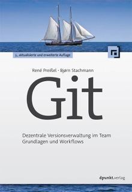

  

    

      
    

    

      René Preißel 
      Bjørn Stachmann

      <h1>Git</h1>
      <h3>Dezentrale Versionsverwaltung im Team Grundlagen und Workflows</h3>
      dpunkt.verlag

    

  

   
  <a class="btn btn-primary btn-lg" href="http://dpunkt.de/buecher/5040/9783864903113-git.html" role="button">
    Buch kaufen
  </a>
  <!-- TODO link für eBook -->
  <a class="btn btn-primary btn-lg" href="https://www.dpunkt.de/buecher/4706/git.html" role="button">
    E-Book kaufen
  </a>
  <!-- TODO link für amazon -->
  <a class="btn btn-primary btn-lg" href="http://www.amazon.de/Git-Dezentrale-Versionsverwaltung-Grundlagen-Workflows/dp/3864901308/" role="button">
    ... oder bei Amazon kaufen
  </a>

  

Was ist das Besondere an eurem Buch?
------------------------------------

Unser Buch zeigt, wie man Git mit einem Team von Entwicklern nutzt.
Dazu beschreibt es konkrete Folgen von Arbeitschritten,
genannt **Workflows**, z. B. "Mit Feature-Branches entwickeln"
oder "Ein Release durchführen". Unser Buch ist also eher
ein *Pattern-Buch* als ein Referenzhandbuch.
Diese Workflows sind, natürlich nicht,
die einzige Art, wie man mit Git arbeiten sollte. Aber sind
praxiserprobt und bieten einen guten Startpunkt, wenn man Git
im Team einführen möchte. Individuell anpassen kann (und wird)
man die Workflows dann im Laufe der Zeit.  

Fehler?! Euer Buch hat Fehler?
-----------------------------

Naja gut, schon. Damit es in der nächsten Auflage besser wird, sammeln wir die Fehler hier:

  <a href="errata.html"><button type="button" class="btn btn-default">Feedback und Errata</button></a>

Warum habt Ihr ein Git-Buch geschrieben?
----------------------------------------

*(Offizielle Antwort)*

Versionsverwaltung ist nicht unser Kernthema.
Eher so: Entwicklung und Softwarearchitektur.
Mund-zu-Mund-Propaganda führte uns zu Git.
Der Linux-Kernel und ein paar andere coole Open-Source-Projekte
würden neuerdings mit *Git* entwickeln, sagte man.
Zunächst waren wir skeptisch:
"Es gibt doch Subversion. Das kann alles, was man braucht, oder?"
Wir haben es trotzdem mal ausprobiert und da steckte doch mehr
in dem "oder?" drin als wir dachten. Begeistert schrieben wir einen
[Artikel][git-artikel] für das [Java Magazin](http://www.javamagazin.de/).

Einen großen Nachteil hat Git allerdings: Enorme Flexibilität.
Man kann Git auf sehr unterschiedliche weisen nutzen und
es für jedes Projekt und jeden Entwickler individuell anpassen.
Natürlich ist genau das auch der Riesenvorteil von Git.
Am Anfang aber erschwert es aber, den Wald vor lauter Bäumen zu erkennen.
Wir wollten zeigen, dass man mit wenigen vorgegebenen Standard-Workflows,
einen schnellen Einstieg finden und schon viel erreichen kann.

*(Noch eine Antwort. Vielleicht etwas ehrlicher)*

Bernd, Christian, Claudia, Olli, Markus, Stefan, Tim, und Uwe
(in alphabetischer Reihenfolge ) haben exzellente Fachbücher geschrieben.
Nur René und Bjørn nicht. Wir wollten auch mal sagen können:
*"Wie ich in meinem Buch geschrieben habe, ..."*
